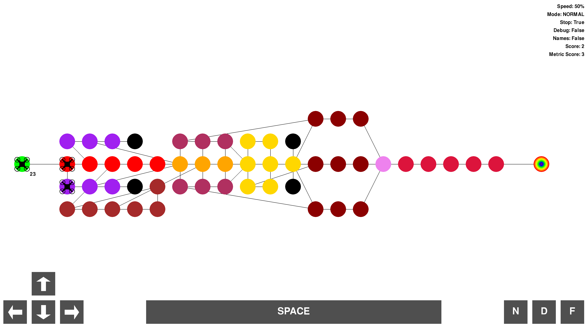

_This project has been created as part of the 42 curriculum by pgougne_

# Description
## 1) Introduction
Drones have been used to herd sheep in New Zealand, replacing sheepdogs with buzzing aerial shepherds. In Japan, office buildings deploy drones that play loud music and flashlights to literally chase overworked employees home. One drone was trained to paint graffiti on walls mid-flight — a rebellious blend of tech and street art. In Sweden, scientists used drones to sniff out whale poop floating on the ocean to study endangered species. Some experimental drones are shaped like birds or insects to spy without being noticed, flapping wings and all. There’s even a drone that flies by flapping soap bubbles, no propellers involved. In volcano research, a drone once flew straight into an eruption cloud, melted mid-air, but managed to send back data just seconds before disintegration. And in South Korea, synchronized drone shows have replaced fireworks — safer, silent, and somehow even more magical.

The phrase comes from the idea that the wheel is a brilliant invention that’s been around forever and works really well. Since there’s nothing wrong with it, trying to invent it again wouldn’t really help and could be a waste of time—especially when that time could be spent solving new problems instead.

In programming, this happens when someone builds something from scratch that already exists — like writing your own sorting algorithm or framework when solid, open-source versions are already out there. But it’s not all bad: doing it yourself can be a great way to learn how things work under the hood. The key is to find a balance — don’t rebuild everything, but take time to explore how the tools you’re using actually work. That way, you’ll grow as a developer without getting stuck reinventing the same old wheels.

## 2) Project
Autonomous drones are the future of transportation. They are already used in many industries, such as agriculture, construction, and logistics. They are also used in military
operations, such as surveillance and reconnaissance.

My task was to design a system that efficiently routes a fleet of drones from a central base (start) to a target location (end), while navigating this dynamic network under a set of strict constraints and optimization goals.

I've been given a graph representing the network of zones, and a set of constraints that you must respect.

The graph is represented as a network of connected zones, where connections define possible movement paths between zones

For this project, I used:

- Pydantic -> parsing
- Pygame -> Visualisation

graph solving:

1) reverse dijkstra
2) Greedy Best-First Search

Personnal choice:
To solve the graph i decided that the priority rule is choosen if the path is free and the lenght of the path is smaller or the same than other possible path that are not flagged as priority.

# Instructions
To run the program:
> Make run

what is does:
>@python -m src path/to/graph.txt

\
To clear all useless files like pycache or mypy
>make clean

\
To check norm and typing:
>make lint

Or the strict version:
>make lint-strict

\
To debug:
>make debug

Input file:
```bash
# Example Level: Simple linear path
nb_drones: 4

start_hub: start 0 0 [color=green zone=restricted]
hub: waypoint1 1 0 [color=blue max_drones=2 zone=restricted]
hub: waypoint2 2 0 [color=blue]
end_hub: goal 3 0 [color=rainbow max_drones=2]

connection: start-waypoint1 [max_link_capacity=3]
connection: waypoint1-waypoint2
connection: waypoint2-goal

```

# Resources
https://www.autodraw.com/\
https://www.numberanalytics.com/blog/complete-dijkstra-algorithm-tutorial#when-to-use-a\
https://www.w3schools.com/
https://www.geeksforgeeks.org/\
https://stackoverflow.com/\
https://pyga.me/docs

AI use:
- Understand how to build the dictionnary that stores the reservation table.
- Explain me some complex concept
- Occasionally debug
- Center letters/arrows in the layout

# Algorithm Description

In first, I calculate a score for each hub that i stored in a dictionnary linking hub and the score.
The score is how many turn it cost to a drone to reach the goal hub from a hub.
e.g:

> src -> hub1 -> hub2 -> goal\
> score = {src: 3, hub1: 2, hub2: 1, goal: 0}

if a hub is restricted, the cost is 2
if a hub is priority, the cost is 0.4, so if two paths are the same lenght, it picks the one with priority. 
With this, it is easy to find the shortest path, you just have to find the smallest score from all neighbor of a current hub.

Now that we have the score of all hub, we want to find the path shortest for all drones, so the first drone will always follow the shortest path but it's not the same for all other drones.

For each drone it looks in a reservation table that save for each hub, how many drones are in for each turn and register to the reservation table for each hub it crosses..

Like this: 

>{'start': {}, 'loop_a': {1: 3, 2: 3, 6: 3}, 'loop_b': {2: 3, 3: 3, 7: 3}, 'loop_c': {4: 3}, 'loop_d': {5: 3}, 'exit_point': {4: 3, 3: 3, 9: 3, 8: 3}, 'goal': {5: 1, 6: 1, 7: 1, 10: 1, 11: 1, 12: 1}}

# Visualisation features

| input | feature |
|-------|---------|
| ↓ | slow down the simulation |
| ↑ | speed up the simulation |
| ← | go to the previous time |
| → | go to the next time |
| space | pause the simulatin |
| f | toggle ant mode |
| n | toggle hub name  |
| d | toggle hub description |


In the normal mode, drones are drones, hubs are colored circles, and connections are simple lines.




I made a ant version of fly-in because ants are very smart, and they made their own algorithm to find the shortest path to reach food.
Even if they don't use djikstra or A*, this is funny.

In this version, drones are ants, hubs are anthills and connections are still simple lines BUT the goal is banana peel


# Ouput example:

for the easy/01 with restricted on goal the output will be:
t1: D0-start-waypoint1 D1-start-waypoint1 
t2: D0-waypoint1 D1-waypoint1 D2-start-waypoint1 
t3: D0-waypoint2 D2-waypoint1 
t4: D0-waypoint2-goal D1-waypoint2 
t5: D0-goal D1-waypoint2-goal D2-waypoint2 
t6: D1-goal D2-waypoint2-goal 
t7: D2-goal

I decided to not print the t0 because it is useless to show that nobody moving.
Each turn, it prints the current hub or connection if the drone is moving
